# SmartHire Architecture Documentation

## Overview

SmartHire follows the **Client Format Pattern** with strict separation of concerns across five distinct layers. This architecture ensures maintainability, scalability, and testability.

---

## Complete Workflow Pipeline (Mermaid Diagram)

```mermaid
graph TD
    %% Entry Point
    START([📄 Resume Upload & Job Selection]) --> TRIGGER[🚀 Workflow Trigger]

    %% Initial Setup
    TRIGGER --> |"Create Initial State<br/>Load Configuration"| INIT[📋 Initialize CandidateState]

    %% Parallel Stages Setup
    INIT --> PARALLEL{"🎯 Launch Analysis Stages"}

    %% Parallel Agent Execution (All agents coordinate via orchestrator)
    PARALLEL --> |"Stage 1"| PARSE[📝 Resume Parser Agent]
    PARALLEL --> |"Stage 2-3 (Parallel)"| EXP[🎓 Experience Predictor Agent]
    PARALLEL --> |"Stage 2-3 (Parallel)"| SCORE[⭐ Resume Scorer Agent]
    PARALLEL --> |"Stage 4"| FIT[🎯 Job Fit Analyzer Agent]
    PARALLEL --> |"Stage 5"| GEN[❓ Question Generator Agent]

    %% Stage Results
    PARSE --> |"Extract Features<br/>Name, Skills, Education<br/>Experience, Projects"| PARSE_RESULT[📝 Parsed Resume Data<br/>Features: Extracted<br/>Quality: Valid/Invalid<br/>Retry Count: 0-1]

    EXP --> |"Classify Experience<br/>Analyze Years & Skills<br/>Gemini AI Assessment"| EXP_RESULT[🎓 Experience Prediction<br/>Level: Junior/Mid/Senior<br/>Confidence: 0.0-1.0<br/>Reasoning: Provided]

    SCORE --> |"Evaluate Resume Quality<br/>Analyze Depth & Breadth<br/>Gemini AI Scoring"| SCORE_RESULT[⭐ Resume Score Results<br/>Score: 0-10<br/>Breakdown: Provided<br/>Feedback: Generated]

    FIT --> |"Analyze Job Compatibility<br/>Match Skills & Experience<br/>Gemini AI Analysis"| FIT_RESULT[🎯 Job Fit Results<br/>Fit Level: Excellent/Good/Moderate/Poor<br/>Score: 0-10<br/>Gap Analysis: Completed]

    GEN --> |"Generate Interview Questions<br/>Personalize to Candidate<br/>5-8 Adaptive Questions"| GEN_RESULT[❓ Generated Questions<br/>Concept Questions: 3-4<br/>Code Questions: 2-3<br/>Reference Answers: Included]

    %% Agent Coordination
    PARSE_RESULT --> COORDINATOR[🔄 Agent Coordinator<br/>State Merger]
    EXP_RESULT --> COORDINATOR
    SCORE_RESULT --> COORDINATOR
    FIT_RESULT --> COORDINATOR
    GEN_RESULT --> COORDINATOR

    %% Coordination Logic
    COORDINATOR --> |"All Stages Complete?"| CHECK{"✅ Completion Check<br/>All Data Gathered?"}
    CHECK --> |"No - Wait"| WAIT[⏳ Wait for<br/>Remaining Stages]
    WAIT --> CHECK
    CHECK --> |"Yes - Proceed"| MERGE[🔀 Smart State Merge<br/>Combine All Results]

    %% State Merging
    MERGE --> |"Clone & Merge<br/>Resolve Conflicts<br/>Aggregate Scores"| MERGED_STATE[📊 Complete Candidate State<br/>All Analysis: Complete<br/>Scores: Aggregated<br/>Questions: Ready]

    %% Display to UI
    MERGED_STATE --> UI[📱 Display Questions to Candidate<br/>Streamlit UI]

    %% Candidate Answers
    UI --> |"Candidate Answers<br/>All 5-8 Questions"| ANSWERS[💬 Collect Answers<br/>Type: Text/Code<br/>Count: 5-8 answers]

    %% Answer Evaluation Stage
    ANSWERS --> EVAL_TRIGGER[🔄 Start Evaluation Workflow]

    EVAL_TRIGGER --> |"For Each Answer"| EVAL_AGENT[🔍 Answer Evaluator Agent]

    EVAL_AGENT --> |"Concept Q: SBERT Similarity<br/>Code Q: Gemini AI Evaluation<br/>Score Each Answer"| EVAL_RESULT[🔍 Evaluation Results<br/>Per-Question Scores: 0-10<br/>Feedback: Generated<br/>Confidence: Provided]

    %% Final Scoring
    EVAL_RESULT --> |"Calculate Composite Score<br/>Average All Answers<br/>Generate Overall Feedback"| FINAL_SCORE[📊 Final Composite Score<br/>Score: 0-10<br/>Interpretation: Provided<br/>Strengths & Weaknesses: Listed]

    %% Decision Making
    FINAL_SCORE --> DECISION{"⚖️ Result Assessment<br/>Multi-Factor Evaluation"}

    %% Multi-Dimensional Decision Matrix
    DECISION --> |"Score < 5.0<br/>Poor Performance"| RESULT_POOR[🔴 Poor Fit<br/>Not Recommended<br/>Feedback: Constructive]
    DECISION --> |"5.0 ≤ Score < 7.0<br/>Moderate Performance"| RESULT_MOD[🟡 Moderate Fit<br/>Consider with Review<br/>Feedback: Detailed]
    DECISION --> |"7.0 ≤ Score < 9.0<br/>Good Performance"| RESULT_GOOD[🟢 Good Fit<br/>Recommended<br/>Feedback: Positive]
    DECISION --> |"Score ≥ 9.0<br/>Excellent Performance"| RESULT_EXCEL[🟢 Excellent Fit<br/>Highly Recommended<br/>Feedback: Excellent]

    %% Reporting
    RESULT_POOR --> REPORT[📄 Generate Final Report]
    RESULT_MOD --> REPORT
    RESULT_GOOD --> REPORT
    RESULT_EXCEL --> REPORT

    %% Email Notifications Throughout Workflow
    PARSE_RESULT --> EMAIL1[📧 Resume Parsing Complete]
    EXP_RESULT --> EMAIL2[📧 Experience Level Determined]
    SCORE_RESULT --> EMAIL3[📧 Resume Score Calculated]
    FIT_RESULT --> EMAIL4[📧 Job Fit Analyzed]
    GEN_RESULT --> EMAIL5[📧 Questions Generated]
    EVAL_RESULT --> EMAIL6[📧 Answers Evaluated]
    FINAL_SCORE --> EMAIL7[📧 Final Score Calculated]

    %% Final Report Generation
    REPORT --> |"Aggregate All Results<br/>Include Metrics & Feedback<br/>Generate Recommendations"| FINAL_REPORT[📄 Comprehensive Report<br/>Candidate Summary<br/>Analysis Results<br/>Recommendation]

    %% Final States
    FINAL_REPORT --> END_POOR([🔴 CANDIDATE EVALUATED<br/>Poor Performance])
    FINAL_REPORT --> END_MOD([🟡 CANDIDATE EVALUATED<br/>Moderate Performance])
    FINAL_REPORT --> END_GOOD([🟢 CANDIDATE QUALIFIED<br/>Good Performance])
    FINAL_REPORT --> END_EXCEL([🟢 CANDIDATE QUALIFIED<br/>Excellent Performance])

    %% Error Handling
    PARSE --> |"Error"| ERROR[❌ Error Handler]
    EXP --> |"Error"| ERROR
    SCORE --> |"Error"| ERROR
    FIT --> |"Error"| ERROR
    GEN --> |"Error"| ERROR
    EVAL_AGENT --> |"Error"| ERROR
    COORDINATOR --> |"Error"| ERROR
    ERROR --> |"Log Error<br/>Apply Fallback<br/>Continue"| ERROR_HANDLE[⚠️ Error Recovery<br/>Fallback Activated]
    ERROR_HANDLE --> MERGED_STATE

    %% Retry Logic for Resume Parsing
    PARSE --> |"Extraction Failed"| RETRY_PARSE[🔄 Retry Resume Parsing<br/>Max: 1 attempt]
    RETRY_PARSE --> |"Retry < 1"| PARSE

    %% Styling with Color Coding
    classDef agentNode fill:#e1f5fe,stroke:#01579b,stroke-width:3px,color:#000000
    classDef resultNode fill:#f3e5f5,stroke:#4a148c,stroke-width:2px,color:#000000
    classDef decisionNode fill:#fff3e0,stroke:#e65100,stroke-width:2px,color:#000000
    classDef excellentNode fill:#c8e6c9,stroke:#1b5e20,stroke-width:3px,color:#000000
    classDef goodNode fill:#e8f5e8,stroke:#2e7d32,stroke-width:2px,color:#000000
    classDef moderateNode fill:#ffe0b2,stroke:#e65100,stroke-width:2px,color:#000000
    classDef poorNode fill:#ffcdd2,stroke:#c62828,stroke-width:2px,color:#000000
    classDef errorNode fill:#fce4ec,stroke:#ad1457,stroke-width:2px,color:#000000
    classDef emailNode fill:#fff9c4,stroke:#f57f17,stroke-width:1px,color:#000000
    classDef defaultNode fill:#f5f5f5,stroke:#424242,stroke-width:2px,color:#000000

    class PARSE,EXP,SCORE,FIT,GEN,EVAL_AGENT agentNode
    class PARSE_RESULT,EXP_RESULT,SCORE_RESULT,FIT_RESULT,GEN_RESULT,EVAL_RESULT,FINAL_SCORE,FINAL_REPORT resultNode
    class DECISION,CHECK decisionNode
    class END_EXCEL,RESULT_EXCEL excellentNode
    class END_GOOD,RESULT_GOOD goodNode
    class END_MOD,RESULT_MOD moderateNode
    class END_POOR,RESULT_POOR poorNode
    class ERROR,ERROR_HANDLE errorNode
    class EMAIL1,EMAIL2,EMAIL3,EMAIL4,EMAIL5,EMAIL6,EMAIL7 emailNode
    class START,TRIGGER,INIT,PARALLEL,COORDINATOR,WAIT,MERGE,MERGED_STATE,UI,ANSWERS,EVAL_TRIGGER,REPORT defaultNode
```



### Workflow Characteristics

- **Total Stages**: 6 (Resume Parsing + 5 Analysis Stages + Answer Evaluation)
- **Parallel Execution**: Experience Predictor & Resume Scorer run simultaneously
- **State Management**: Smart merging of results from parallel stages
- **Error Handling**: Layer-by-layer fallbacks and retry logic
- **Performance**: 30-45 seconds for complete pipeline
- **Notifications**: Email updates at each stage completion
- **Final Output**: Comprehensive report with recommendations

---

## Architecture Layers

### Layer 1: Tool Layer (analyzers/)

**Purpose**: Pure analysis tools with NO state management or orchestration logic

**Components**:
- `AIAnalyzer` - Gemini AI wrapper (PRIMARY - all predictions)
- `SemanticAnalyzer` - SBERT wrapper (SUPPORTING - similarity only)

**Responsibilities**:
- ✅ Perform AI/ML/Semantic operations
- ✅ Return pure data structures
- ❌ NO state management
- ❌ NO orchestration logic
- ❌ NO side effects (except logging)

**Example**:
```python
class AIAnalyzer:
    def parse_resume(self, resume_text: str) -> Dict[str, Any]:
        # Pure function: text in, dict out
        return extracted_features
```

---

### Layer 2: Agent Layer (agents/)

**Purpose**: Coordinators that use analyzers as tools

**Components**:
- `ResumeParserAgent`
- `ExperiencePredictorAgent`
- `ResumeScorerAgent`
- `JobFitAnalyzerAgent`
- `QuestionGeneratorAgent`
- `AnswerEvaluatorAgent`

**Responsibilities**:
- ✅ Coordinate analysis using tools
- ✅ Implement business logic
- ✅ Handle errors and fallbacks
- ❌ NO direct AI/ML calls
- ❌ NO state updates
- ❌ NO orchestration

**Example**:
```python
class ResumeParserAgent(BaseAgent):
    def __init__(self):
        self.ai_analyzer = AIAnalyzer()  # Use tool
    
    def analyze(self, resume_text: str) -> Dict[str, Any]:
        # Coordinate using analyzer
        return self.ai_analyzer.parse_resume(resume_text)
```

---

### Layer 3: Node Layer (nodes/)

**Purpose**: Thin wrappers that call agents and update state

**Components**:
- `resume_parser_node`
- `experience_predictor_node`
- `resume_scorer_node`
- `job_fit_analyzer_node`
- `question_generator_node`
- `answer_evaluator_node`

**Responsibilities**:
- ✅ Call agent's analyze() method
- ✅ Update CandidateState
- ✅ Return updated state
- ❌ NO business logic
- ❌ NO tool usage
- ❌ NO orchestration

**Example**:
```python
def resume_parser_node(state: CandidateState) -> CandidateState:
    result = agent.analyze(state.resume_text)
    state.resume_features = result
    return state
```

---

### Layer 4: Workflow Layer (workflows/)

**Purpose**: Define stage sequences and build graphs

**Components**:
- `build_hiring_workflow()`
- `build_evaluation_workflow()`

**Responsibilities**:
- ✅ Define stage sequences
- ✅ Build HiringGraph instances
- ✅ Configure parallelism
- ❌ NO execution logic
- ❌ NO business logic
- ❌ NO state management

**Example**:
```python
def build_hiring_workflow() -> HiringGraph:
    stages = [
        [resume_parser_node],
        [experience_predictor_node],
        [resume_scorer_node],
        [job_fit_analyzer_node],
        [question_generator_node]
    ]
    return HiringGraph(stages=stages)
```

---

### Layer 5: Orchestration Layer (graph.py)

**Purpose**: Execute workflows and manage state flow

**Components**:
- `HiringGraph` class

**Responsibilities**:
- ✅ Execute stages sequentially
- ✅ Handle parallel execution (if needed)
- ✅ Merge state from parallel nodes
- ✅ Error handling and logging
- ❌ NO business logic
- ❌ NO tool usage

**Example**:
```python
class HiringGraph:
    def run(self, initial_state: CandidateState) -> CandidateState:
        for stage in self.stages:
            for node in stage:
                result = node(main_state)
                main_state = result
        return main_state
```

---

## Data Flow

### Main Workflow

```
User Input (Resume + Job)
    ↓
CandidateState (initial)
    ↓
HiringGraph.run()
    ↓
Stage 1: resume_parser_node
    → ResumeParserAgent
    → AIAnalyzer.parse_resume()
    → Update state.resume_features
    ↓
Stage 2: experience_predictor_node
    → ExperiencePredictorAgent
    → MLAnalyzer.predict_experience_level()
    → Update state.experience_level
    ↓
Stage 3: resume_scorer_node
    → ResumeScorerAgent
    → MLAnalyzer.score_resume()
    → Update state.resume_score
    ↓
Stage 4: job_fit_analyzer_node
    → JobFitAnalyzerAgent
    → AIAnalyzer.analyze_job_fit()
    → Update state.job_fit
    ↓
Stage 5: question_generator_node
    → QuestionGeneratorAgent
    → AIAnalyzer.generate_questions()
    → Update state.questions
    ↓
CandidateState (with questions)
    ↓
[USER ANSWERS QUESTIONS]
    ↓
Stage 6: answer_evaluator_node
    → AnswerEvaluatorAgent
    → SemanticAnalyzer + AIAnalyzer
    → Update state.answers, state.final_score
    ↓
CandidateState (final)
```

---

## State Management

### CandidateState Design

```python
@dataclass
class CandidateState:
    # Input data (immutable after creation)
    resume_text: str
    job_description: str
    job_title: str
    
    # Analysis results (populated by agents)
    resume_features: Dict
    experience_level: str
    resume_score: float
    job_fit: Dict
    
    # Interview data
    questions: List[Dict]
    answers: List[Dict]
    
    # Results
    final_score: float
    
    # Metadata
    current_step: str
    errors: List[str]
    workflow_complete: bool
```

### State Methods

**clone()** - Deep copy for parallel execution
```python
state_copy = state.clone()
```

**merge_from()** - Smart merge from parallel results
```python
main_state.merge_from(parallel_result)
```

**to_dict()** - Convert to dictionary
```python
state_dict = state.to_dict()
```

---

## Separation of Concerns

### What Goes Where?

| Layer | Responsibility | Can Do | Cannot Do |
|-------|---------------|--------|-----------|
| **Analyzers** | Pure tools | AI/ML operations, return data | State management, orchestration |
| **Agents** | Coordinators | Use analyzers, business logic | Direct AI/ML, state updates |
| **Nodes** | Wrappers | Call agents, update state | Business logic, tool usage |
| **Workflows** | Builders | Define stages, build graphs | Execute, business logic |
| **Graph** | Orchestrator | Execute stages, manage flow | Business logic, tool usage |

---

## Key Design Principles

### 1. Single Responsibility

Each component has ONE clear responsibility:
- Analyzers: Analyze
- Agents: Coordinate
- Nodes: Wrap
- Workflows: Build
- Graph: Orchestrate

### 2. Dependency Inversion

Higher layers depend on abstractions, not implementations:
- Agents depend on analyzer interfaces
- Nodes depend on agent interfaces
- Workflows depend on node functions

### 3. Open/Closed Principle

Open for extension, closed for modification:
- Add new analyzers without changing agents
- Add new agents without changing nodes
- Add new nodes without changing workflows

### 4. Interface Segregation

Each layer exposes minimal interface:
- Analyzers: analyze() methods
- Agents: analyze() method
- Nodes: node(state) -> state
- Workflows: build_*_workflow()
- Graph: run(state) -> state

---

## Error Handling Strategy

### Layer-by-Layer

**Analyzers**:
- Try AI/ML operation
- Catch exceptions
- Return fallback result
- Log error

**Agents**:
- Try analyzer call
- Catch exceptions
- Try fallback analyzer
- Log error

**Nodes**:
- Try agent call
- Catch exceptions
- Add error to state.errors
- Return state (don't crash)

**Graph**:
- Try node execution
- Catch exceptions
- Log error
- Continue to next stage (unless raise_on_error=True)

---

## Configuration Management

### ConfigManager Pattern

Singleton pattern for centralized configuration:

```python
config = get_config()
api_key = config.get("GEMINI_API_KEY_1")
```

### Configuration Sources (Priority Order)

1. Environment variables
2. .env file
3. Default values

---

## Logging Strategy

### Hierarchical Logging

```
root
├── graph (orchestration logs)
├── agent.* (agent-specific logs)
│   ├── agent.resume_parser
│   ├── agent.experience_predictor
│   └── ...
├── analyzer.* (analyzer-specific logs)
│   ├── analyzer.ai
│   ├── analyzer.ml
│   └── analyzer.semantic
└── node.* (node-specific logs)
```

### Log Levels

- **DEBUG**: Detailed execution flow
- **INFO**: Major milestones
- **WARNING**: Fallbacks used
- **ERROR**: Failures (with fallback)

---

## Testing Strategy

### Unit Tests

**Analyzers**: Test pure functions
```python
def test_ai_analyzer_parse_resume():
    analyzer = AIAnalyzer()
    result = analyzer.parse_resume(sample_text)
    assert "full_name" in result
```

**Agents**: Test coordination logic
```python
def test_resume_parser_agent():
    agent = ResumeParserAgent()
    result = agent.analyze(sample_text)
    assert result is not None
```

**Nodes**: Test state updates
```python
def test_resume_parser_node():
    state = CandidateState(resume_text="...")
    result = resume_parser_node(state)
    assert result.resume_features is not None
```

### Integration Tests

**Workflows**: Test end-to-end
```python
def test_hiring_workflow():
    workflow = build_hiring_workflow()
    state = CandidateState(...)
    result = workflow.run(state)
    assert result.workflow_complete
```

---

## Performance Considerations

### Optimization Points

1. **Parallel Execution**: Multiple nodes in same stage run concurrently
2. **Caching**: Cache ML model loading
3. **Lazy Loading**: Load analyzers only when needed
4. **Batch Processing**: Process multiple candidates in parallel

### Bottlenecks

1. **AI API Calls**: 5-10 seconds per call
2. **PDF Extraction**: 1-2 seconds per file
3. **ML Inference**: <1 second per prediction

---

## Scalability

### Horizontal Scaling

- Run multiple Streamlit instances
- Load balance with nginx
- Share state via Redis/database

### Vertical Scaling

- Increase max_workers for parallel execution
- Use GPU for ML inference
- Cache frequently used data

---

## Security Considerations

1. **API Keys**: Store in .env, never commit
2. **Input Validation**: Validate all user inputs
3. **PDF Safety**: Validate PDF files before processing
4. **Rate Limiting**: Implement API rate limiting
5. **Data Privacy**: Don't log sensitive candidate data

---

## Future Enhancements

### Potential Improvements

1. **Parallel Stage Execution**: Run independent stages in parallel
2. **Conditional Routing**: Skip stages based on conditions
3. **Retry Logic**: Automatic retry for failed operations
4. **Caching Layer**: Cache analysis results
5. **Database Integration**: Persist candidate data
6. **Real-time Updates**: WebSocket for live progress
7. **Batch Processing**: Process multiple candidates
8. **Custom Workflows**: User-defined workflow stages

---

## Conclusion

SmartHire's architecture provides:
- ✅ Clear separation of concerns
- ✅ Easy to test and maintain
- ✅ Scalable and extensible
- ✅ Production-ready error handling
- ✅ Follows industry best practices

The client format pattern ensures that each layer has a single, well-defined responsibility, making the system robust and maintainable.
