# SmartHire - AI-Powered Intelligent Hiring System

**Multi-Agent Hiring System with Client Format Architecture**

A production-ready automated candidate evaluation system built following the client format pattern with proper separation of concerns.

---

## Overview

Automatically processes candidate resumes through a 5-stage analysis pipeline and generates personalized interview questions with intelligent answer evaluation in 30-45 seconds.

### Key Features

- **Client Format Architecture** - Agents, Analyzers, Workflows separation
- **GenAI-Powered System** - Uses only Gemini AI (no ML models)
- **Intelligent Orchestration** - Custom HiringGraph execution engine
- **@dataclass State** - With clone() and smart merge_from() methods
- **Dual Evaluation System** - SBERT for concepts, Gemini AI for code
- **AI-Powered Predictions** - All predictions use Gemini AI
- **Personalized Questions** - Adapted to candidate profile and experience level

---

## Project Structure

```
SmartHire-AI-Hiring-System/
├── agents/                         # Agent CLASSES (coordinators)
│   ├── base_agent.py              # BaseAgent class
│   ├── resume_parser_agent.py     # Resume parsing coordinator
│   ├── experience_predictor_agent.py  # Experience prediction coordinator
│   ├── resume_scorer_agent.py     # Resume scoring coordinator
│   ├── job_fit_analyzer_agent.py  # Job fit coordinator
│   ├── question_generator_agent.py    # Question generation coordinator
│   └── answer_evaluator_agent.py  # Answer evaluation coordinator
│
├── analyzers/                      # Pure TOOLS (separate folder)
│   ├── ai_analyzer.py             # Gemini AI wrapper (PRIMARY)
│   └── semantic_analyzer.py       # SBERT wrapper (semantic similarity)
│
├── nodes/                          # Simplified business logic wrappers
│   ├── resume_parser_node.py      # Calls ResumeParserAgent
│   ├── experience_predictor_node.py   # Calls ExperiencePredictorAgent
│   ├── resume_scorer_node.py      # Calls ResumeScorerAgent
│   ├── job_fit_analyzer_node.py   # Calls JobFitAnalyzerAgent
│   ├── question_generator_node.py # Calls QuestionGeneratorAgent
│   └── answer_evaluator_node.py   # Calls AnswerEvaluatorAgent
│
├── workflows/                      # Workflow definitions
│   └── hiring_workflow.py         # build_hiring_workflow()
│
├── utils/                          # Utilities
│   ├── gemini_client.py           # Gemini API wrapper
│   ├── logging_utils.py           # Logging configuration
│   └── pdf_extractor.py           # PDF text extraction
│
├── data/                           # Data files
│   ├── resume/                    # PDF resume files (organized by job role)
│   │   ├── Software Engineer/
│   │   ├── Data Engineer/
│   │   ├── Test Engineer/
│   │   └── Frontend Developer/
│   └── job_descriptions.csv       # Job specifications (REQUIRED)
│
├── graph.py                        # HiringGraph CLASS
├── state.py                        # CandidateState @dataclass
├── config.py                       # Configuration management
├── main.py                         # Streamlit application
├── requirements.txt                # Dependencies (pinned versions)
├── .env                            # Configuration (with API keys)
├── .env.example                    # Configuration template
└── HELPER.md                       # Cleanup guide for ML files
```

---

## Quick Start

### Installation

```bash
git clone https://github.com/Amruth22/SmartHire-AI-Hiring-System.git
cd SmartHire-AI-Hiring-System
python -m venv venv
source venv/bin/activate  # Windows: venv\Scripts\activate
pip install -r requirements.txt
mkdir logs
```

### Configuration

```bash
cp .env.example .env
# Edit .env with your Gemini API keys
```

Required configuration (4 Gemini API keys):
```env
GEMINI_API_KEY_1=your_gemini_api_key_here
GEMINI_API_KEY_2=your_gemini_api_key_here
GEMINI_API_KEY_3=your_gemini_api_key_here
GEMINI_API_KEY_4=your_gemini_api_key_here
```

### Prepare Data

1. Add job descriptions to `data/job_descriptions.csv` (required)
2. Add resume PDFs to `data/resume/[Job Role]/` directories

### Run Application

```bash
streamlit run main.py
```

The app will be available at `http://localhost:8503`

---

## Architecture

### The Client Format Pattern

```
┌─────────────────────────────────────────┐
│         WORKFLOWS LAYER                 │
│      (workflow definitions)             │
│  • build_hiring_workflow()              │
│  • build_evaluation_workflow()          │
└─────────────────────────────────────────┘
                  │
                  ▼
┌─────────────────────────────────────────┐
│         ORCHESTRATION LAYER             │
│            (graph.py)                   │
│  • HiringGraph class                    │
│  • Sequential execution engine          │
│  • Stage management                     │
└─────────────────────────────────────────┘
                  │
                  ▼
┌─────────────────────────────────────────┐
│        BUSINESS LOGIC LAYER             │
│            (nodes/)                     │
│  • Thin wrappers                        │
│  • Call agents                          │
│  • Update state                         │
└─────────────────────────────────────────┘
                  │
                  ▼
┌─────────────────────────────────────────┐
│           AGENT LAYER                   │
│           (agents/)                     │
│  • Agent classes                        │
│  • Coordinate analysis                  │
│  • Use analyzers as tools               │
└─────────────────────────────────────────┘
                  │
                  ▼
┌─────────────────────────────────────────┐
│           TOOL LAYER                    │
│           (analyzers/)                  │
│  • Pure analysis tools                  │
│  • GenAI (Gemini) - PRIMARY             │
│  • Semantic (SBERT) - for similarity    │
└─────────────────────────────────────────┘
```

---

## Workflow Execution

### Complete AI-Powered Pipeline

```mermaid
graph TD
    START([📄 Resume Upload & Job Selection]) --> PARSE["<b>Stage 1: Resume Parsing</b><br/>Gemini AI extracts:<br/>- Name, email, phone<br/>- Skills, experience, education<br/>- Projects, certifications"]

    PARSE --> EXP["<b>Stage 2: Experience Prediction</b><br/>Gemini AI classifies:<br/>- Junior 0-2 years<br/>- Mid-Level 2-5 years<br/>- Senior 5+ years"]

    EXP --> SCORE["<b>Stage 3: Resume Scoring</b><br/>Gemini AI evaluates:<br/>- Experience depth<br/>- Skills breadth<br/>- Projects quality<br/>- Score: 0-10"]

    SCORE --> FIT["<b>Stage 4: Job Fit Analysis</b><br/>Gemini AI analyzes:<br/>- Skill matching<br/>- Experience match<br/>- Fit score 0-10<br/>- Skill gaps identified"]

    FIT --> QUESTIONS["<b>Stage 5: Question Generation</b><br/>Gemini AI creates:<br/>- 5-8 personalized questions<br/>- Mix of concept & code<br/>- Reference answers included"]

    QUESTIONS --> UI["📱 Display Questions<br/>Candidate Answers"]

    UI --> EVAL["<b>Stage 6: Answer Evaluation</b><br/>SBERT + Gemini AI:<br/>- Concept Q: Semantic similarity<br/>- Code Q: AI evaluation<br/>- Per-question scores<br/>- Composite final score"]

    EVAL --> RESULTS["📊 Final Results<br/>Comprehensive Report<br/>Generated"]

    RESULTS --> END([✅ Complete - 30-45 seconds])

    style START fill:#e1f5fe,stroke:#01579b,stroke-width:2px,color:#000
    style PARSE fill:#f3e5f5,stroke:#4a148c,stroke-width:2px,color:#000
    style EXP fill:#f3e5f5,stroke:#4a148c,stroke-width:2px,color:#000
    style SCORE fill:#f3e5f5,stroke:#4a148c,stroke-width:2px,color:#000
    style FIT fill:#f3e5f5,stroke:#4a148c,stroke-width:2px,color:#000
    style QUESTIONS fill:#f3e5f5,stroke:#4a148c,stroke-width:2px,color:#000
    style UI fill:#fff3e0,stroke:#e65100,stroke-width:2px,color:#000
    style EVAL fill:#f3e5f5,stroke:#4a148c,stroke-width:2px,color:#000
    style RESULTS fill:#e8f5e8,stroke:#2e7d32,stroke-width:2px,color:#000
    style END fill:#c8e6c9,stroke:#1b5e20,stroke-width:2px,color:#000
```



**Performance**: 30-45 seconds for complete candidate analysis
**Technology**: Gemini 2.0 Flash (all 6 stages use AI)
**Parallelization**: Stages can run in parallel (configurable workers)

---

## Key Components

### Analyzers (Tools Layer)

**AIAnalyzer** - Gemini AI wrapper (PRIMARY)
- Resume parsing with JSON extraction
- Experience level prediction
- Resume quality scoring
- Job fit analysis
- Question generation
- Code answer evaluation

**SemanticAnalyzer** - SBERT wrapper (SUPPORTING)
- Semantic similarity calculation
- Concept answer evaluation

### Agents (Coordinator Layer)

All agents inherit from `BaseAgent` and use analyzers as tools:
- **ResumeParserAgent** - Uses AIAnalyzer for feature extraction
- **ExperiencePredictorAgent** - Uses AIAnalyzer for classification
- **ResumeScorerAgent** - Uses AIAnalyzer for scoring
- **JobFitAnalyzerAgent** - Uses AIAnalyzer for compatibility analysis
- **QuestionGeneratorAgent** - Uses AIAnalyzer for personalization
- **AnswerEvaluatorAgent** - Uses SemanticAnalyzer + AIAnalyzer for evaluation

### Nodes (Wrapper Layer)

Simplified wrappers that:
1. Call agent's analyze() method
2. Update CandidateState
3. Return updated state

### Workflows (Builder Layer)

- `build_hiring_workflow()` - Main 5-stage pipeline
- `build_evaluation_workflow()` - Answer evaluation pipeline

---

## State Management

### CandidateState (@dataclass)

```python
@dataclass
class CandidateState:
    # Input data
    resume_text: str
    job_description: str
    job_title: str
    
    # Analysis results
    resume_features: Dict
    experience_level: str
    resume_score: float
    job_fit: Dict
    questions: List[Dict]
    answers: List[Dict]
    
    # Results
    final_score: float
    
    # Methods
    def clone() -> CandidateState
    def merge_from(other: CandidateState)
    def to_dict() -> Dict
```

---

## Separation of Concerns

### What Goes Where?

**Analyzers** (Pure Tools)
- ✅ AI/ML/Semantic operations
- ✅ Pure functions
- ❌ NO state management
- ❌ NO orchestration

**Agents** (Coordinators)
- ✅ Use analyzers as tools
- ✅ Coordinate analysis
- ❌ NO direct AI/ML calls
- ❌ NO state updates

**Nodes** (Wrappers)
- ✅ Call agents
- ✅ Update state
- ❌ NO business logic
- ❌ NO tool usage

**Workflows** (Builders)
- ✅ Define stage sequences
- ✅ Build graphs
- ❌ NO execution logic
- ❌ NO business logic

**Graph** (Orchestrator)
- ✅ Execute stages
- ✅ Manage state flow
- ❌ NO business logic
- ❌ NO tool usage

---

## Usage Example

```python
from state import CandidateState
from workflows import build_hiring_workflow
from utils import extract_text_from_pdf

# Extract resume text
resume_text = extract_text_from_pdf("resume.pdf")

# Create initial state
state = CandidateState(
    resume_text=resume_text,
    job_description="Software Engineer position...",
    job_title="Software Engineer"
)

# Build and run workflow
workflow = build_hiring_workflow()
result = workflow.run(state)

# Access results
print(f"Candidate: {result.candidate_name}")
print(f"Experience: {result.experience_level}")
print(f"Resume Score: {result.resume_score}/10")
print(f"Job Fit: {result.job_fit['job_fit']}")
print(f"Questions: {len(result.questions)}")
```

---

## AI-Powered Predictions

The system uses **Gemini AI** for all predictions (no ML models):

1. **Experience Level Prediction**
   - Analyzes: total_experience_years, skills, projects, certifications
   - Output: Junior / Mid-Level / Senior with confidence score
   - Fallback: Rule-based classification

2. **Resume Scoring**
   - Analyzes: experience depth, skills breadth, projects, certifications, education
   - Output: Score 0-10 with breakdown
   - Fallback: Rule-based scoring

---

## Configuration Reference

### Required Variables

- `GEMINI_API_KEY_1` - Resume parsing
- `GEMINI_API_KEY_2` - Experience prediction & job fit
- `GEMINI_API_KEY_3` - Question generation
- `GEMINI_API_KEY_4` - Answer evaluation

### Optional Variables

- `GEMINI_MODEL` - Model name (default: gemini-2.0-flash)
- `CONFIDENCE_THRESHOLD` - Minimum confidence (default: 0.8)
- `MIN_RESUME_SCORE` - Minimum resume score (default: 5.0)
- `MIN_JOB_FIT_SCORE` - Minimum job fit score (default: 6.0)
- `LOG_LEVEL` - Logging level (default: INFO)
- `MAX_WORKERS` - Parallel workers (default: 3)

---

## Learning Value

This project demonstrates:
- ✅ Client format architecture pattern
- ✅ Proper separation of concerns
- ✅ Agent/Analyzer/Node separation
- ✅ Custom graph execution engine
- ✅ @dataclass state management with smart merge
- ✅ Workflow builder pattern
- ✅ Multi-layer AI/ML integration
- ✅ Production-ready code structure

---

## Testing

### Run Unit Tests

```bash
# Run all 10 core tests
python tests.py

# Or with unittest
python -m unittest tests.py -v
```

### Test Coverage (10 Core Tests)

1. **test_1_api_keys_loaded** - Verify Gemini API keys from .env
2. **test_2_config_validation** - Validate configuration
3. **test_3_job_descriptions_exists** - CSV file integrity
4. **test_4_state_creation** - CandidateState initialization
5. **test_5_state_cloning** - Parallel execution support
6. **test_6_ai_analyzer** - AIAnalyzer initialization
7. **test_7_semantic_analyzer** - Semantic similarity calculation
8. **test_8_resume_parser_agent** - Resume parsing functionality
9. **test_9_experience_predictor_agent** - Experience prediction
10. **test_10_workflow_creation** - Workflow builder

**Result**: All 10 tests PASS ✅

---

## System Requirements

### Minimum Requirements

- **Python**: 3.8 or higher
- **RAM**: 4GB minimum (8GB recommended for SBERT)
- **Disk**: 2GB free space (for models and logs)
- **Internet**: Required (Gemini API calls)

### API Requirements

- **4 Gemini API Keys**: Required for production (can use same key 4x)
- **Rate Limits**: Monitor Google Cloud console

### Dependencies

- See `requirements.txt` for complete list
- Total install size: ~2GB (includes PyTorch for SBERT)

---

## Status

**PRODUCTION READY - v2.1.0**

### Fully Implemented Components

- ✅ 6 specialized agents + BaseAgent coordinator
- ✅ 2 analyzers (AIAnalyzer + SemanticAnalyzer)
- ✅ 6 nodes for orchestration
- ✅ 2 workflow builders (hiring + evaluation)
- ✅ HiringGraph orchestration engine (with parallel execution)
- ✅ CandidateState @dataclass (clone & merge methods)
- ✅ ConfigManager singleton (with .env support)
- ✅ Gemini AI wrapper + PDF extraction utilities
- ✅ Hierarchical logging system
- ✅ Streamlit web UI (3 tabs)

### Cleanup & Optimization

- ✅ ML files removed (ml_analyzer.py, models/, train_models.py)
- ✅ GenAI-only system (all predictions use Gemini 2.0 Flash)
- ✅ Dependencies pinned to compatible versions
- ✅ Fast startup (8-10 seconds import time)
- ✅ 10 core unit tests (100% pass rate)

### Performance Metrics

- **Import Time**: 8-10 seconds
- **Pipeline Time**: 30-45 seconds per candidate
- **Concurrent Support**: 3 parallel workers (configurable)
- **Test Execution**: ~60 seconds for all 10 tests

---

## License

MIT License

---

## Acknowledgments

- **Client Format Pattern** - Based on ai-incident-response-client-format reference
- **LangGraph Principles** - For multi-agent orchestration concepts

---

**Built with proper separation of concerns following client format architecture**

**Repository**: https://github.com/Amruth22/SmartHire-AI-Hiring-System

**Status**: PRODUCTION READY
